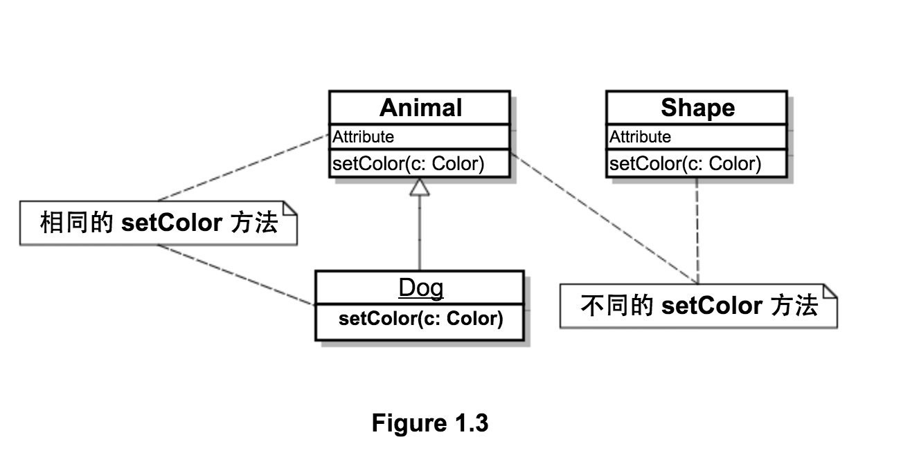

# 1.6.3 避开调用陷阱

在前面的例子中，每次都是调用 `setColor` 方法，能不能通过 **缓存** 该方法提升运行效率呢？

答案是不能。因为具有相同签名的方法，不一定是相同的方法，在 Java 中，方法由 **声明方法的类** 和 **方法签名** 唯一确定。

* `Animal` 与 `Dog` 中的 `setColor` 方法是相同的。
* `Animal` 与 `Shape` 中的 `setColor` 方法是 **不同的**，虽然方法签名相同，但却是在 **不同类** 中声明的。

`invoke` 方法抛出的异常总结如下：

1. `IllegalAccessException`：访问权限不足，比如无足够权限调用 `private` 方法时。
2. `IllegalArgumentException`：
	* 调用对象 **不支持** 被调用的方法（未定义等）。
	* 参数类型错误。
	* 参数长度错误。
3. `InvocationTargetException`：被调用方法抛出的 **任何异常** 都被包装为 `InvocationTargetException` 抛出。

动态调用是 Java 反射中的重要特性，如果没有动态调用，则所有的调用都必须在 **编译时** 硬编码在代码中，失去灵活性。