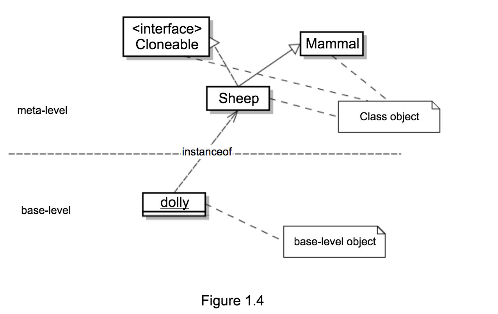

# 1.7 为反射建模

本书使用 UML 建模，与其他地方不同，本书综合使用 **对象视图** 和 **类视图**，并没有把他们割裂开。

反射涉及运行时的所有实体，自然包括普通对象和 `Class` 对象，把他们放到一起才能清楚说明问题，二者之间通过 `instanceof` 进行关联，与 Java 中的 `instanceof` 不同，这里的 `instanceof` 仅仅表示直接实例，不包含继承实例。

图 1.4 是克隆羊多利的例子，其中既包含 **基础层** 的普通对象，又包含 **元数据层** 的 `Class` 对象，两者之间通过 `instanceof` 关联。