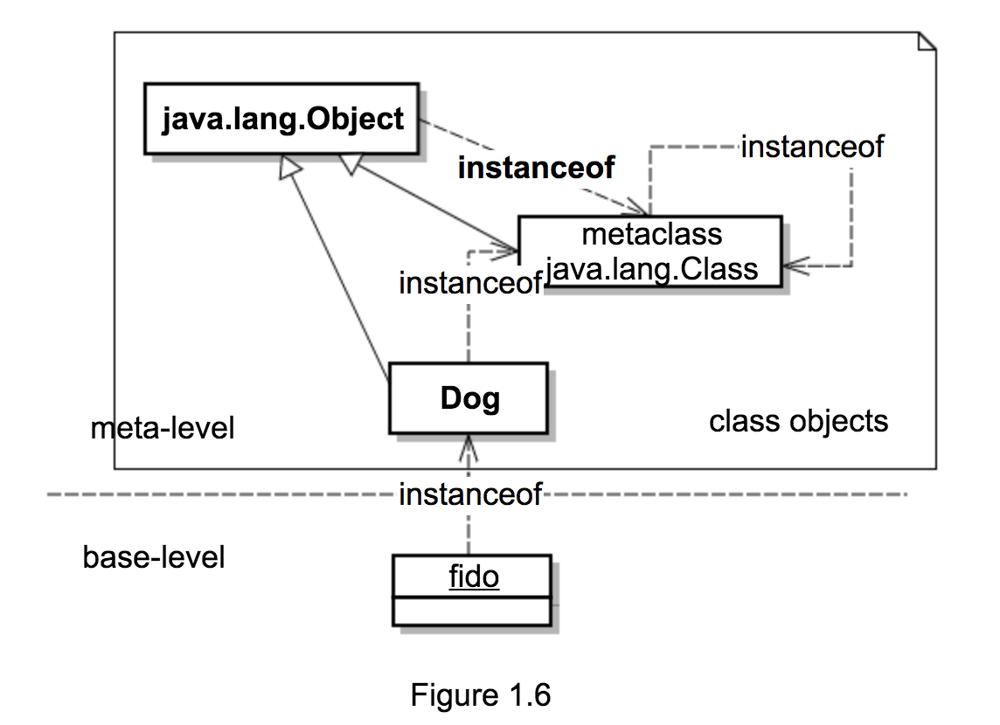

# 1.8_3 另外一种反射循环

在上一节图 1.5 中加入继承产生图 1.6：



```
// true
Class.class.isInstance(Object.class);
```
* 表明 `Object` 作为类，其 `class` 对象是 `Class` 元类的实例对象（**反射角度**）。

```
// true
Object.class.isAssignableFrom(Class.class);
```
* 表明 `Class` 作为类，是 `Object` 类的 **子类**（**继承角度**）。

`Class` 与 `Object` 的关系：

* **继承角度**
	+ Java 中，**一切皆对象**，所有对象的父类为 `Object`，`Class` 也不例外，所以 `Object` 为 `Class` 的父类。
* **反射角度**
	+ 在反射概念中，**元类** `Class` 的实例是 **类**，`Object` 是类，所以 `Object` 的 `class` 对象是 `Class` 的实例对象。

