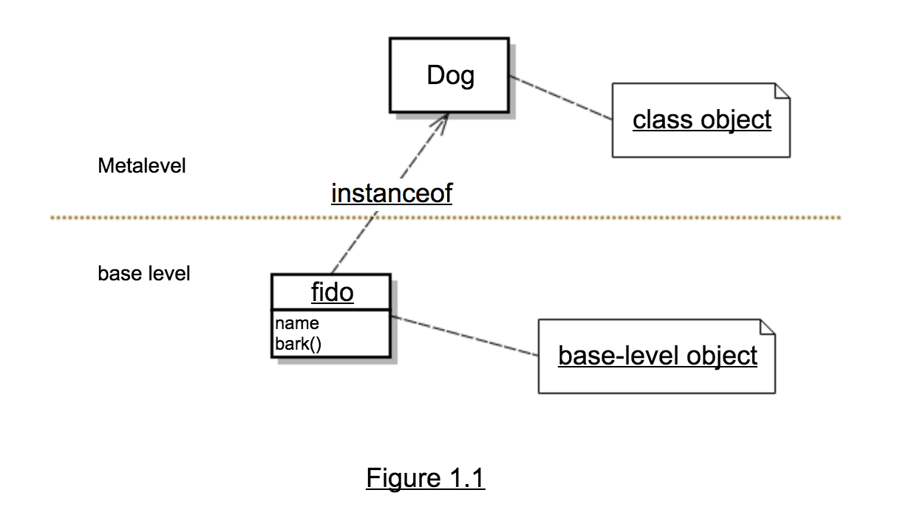

# 1.3 检查运行时的程序

**反射**是程序能够在运行时自省，并且改变自身行为、数据结构的能力。1.2 节中的场景已经初步显示出反射的优势。下面进一步说明反射对于 Java 程序结构的意义。

可以把自省想象成照镜子，镜子提供了自身形象的一种表示供我们检查，检查镜子里自己的形象可以获取各种有用的信息，比如 T 恤与裤子是否搭配良好等，这些信息可以帮助我们整理自己的衣橱。

镜子还能反映自己的行为，你可以检查自己的笑容是否真诚，或者动作是否有侵略性。这些信息对于调整自身行为从而给别人留下好印象很重要。

同理，为了能够自省，程序必须能够获取自身的一种表示形式。在反射系统中，这种自我表示是最重要的结构元素。通过检查自我表示，程序可以获取自身结构、行为的正确信息，从而做出重要决策。

1.2 节的例子使用 `Class` `Method` 类的实例来找到合适的 `setColor` 方法调用，这些实例是 Java 自我表示的一部分，我们称可以作为程序自我表示的对象为**元对象***（metaobjects），`meta` 是一个英文前缀，通常表示关于或超越，在这里，`metaobjects` 是持有关于程序的信息的对象。

`Class` 和 `Method` 是普通 Java 类，他们的实例持有程序的相关信息，我们称 `Class` 这种类型为元对象的类（`classes of metaobjects`）或者元对象类（`metaobject class`），元对象类组成了 Java 反射 API 的大部分。

我们称实现应用主要功能的对象为基础层对象（`base-level objects`），在 `setObjectColor` 方法中，调用该方法的对象、作为参数传入该方法的对象都是基础层对象。我们把程序中的非反射部分称为基础程序（`base program`）。

元对象表示了运行时程序的部分内容，因此可能描述了基础程序，下图展示了基础层对象、描述基础层对象的类型的对象之间的 `instanceof` 关系。

元对象是反射编程中很方便的自我表示形式，如果没有元对象，George 必须用源码或者字节码来作为程序的自我表示，这样一来就需要解析代码，而使用元对象，则无需额外解析就能获取相关信息。

元对象经常提供一些修改程序结构、行为或数据的方法，在上述例子中，George 使用动态调用调用了自省发现的方法，其他修改程序的反射功能包括反射构建、动态加载、拦截方法调用。