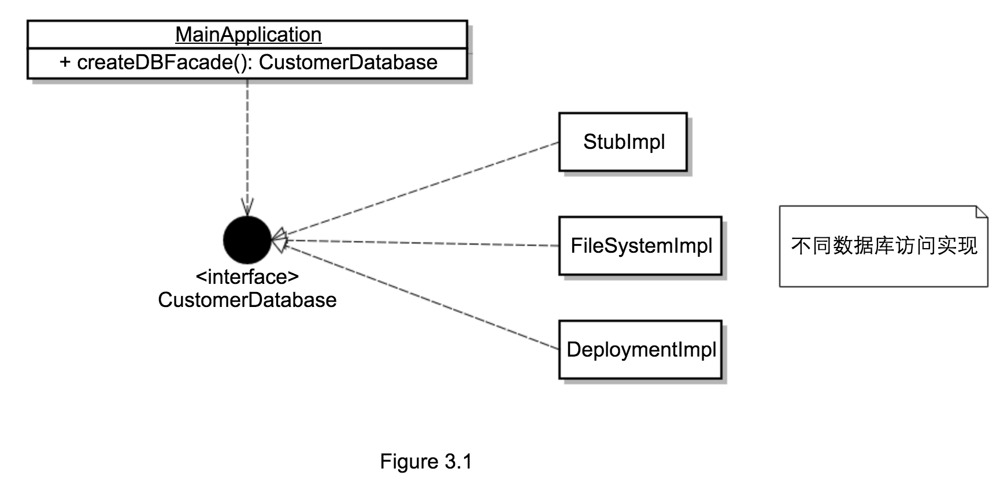

# 3.1.1 使用设计模式进行设计

为了能让自己的应用产品化，George 必须将 **客户相关的数据库访问代码** 与应用剩余部分分开，而且需要支持在实现、测试、部署阶段使用 **不同** 的 **数据库访问代码**。

George 决定使用 **模式** 和 **委托** 以获取更大的灵活性，委托是指一个对象 **依赖** 其他对象 **实际** 完成自己的工作，George 想要使用如下模式（模式中使用了委托）来设计自己的应用：

* **外观模式**（门面模式）
  + 装饰者模式为子系统中的 **一组接口** 提供 **统一** 的访问接口，从而 **屏蔽** 子系统的复杂性。
  + 本例中，George 为 Noah 公司的数据库提供的 *所有服务* 创建一个接口，在应用中使用 **该接口的实现** 来执行数据库操作，使用该模式，可以在接口实现中选择 **不同数据库**。
* **工厂方法模式**
  + 工厂方法可以在 **未指定具体类** 时创建对象。
  + 使用工厂方法创建 `facade` 接口的实现，这样可以在在工厂中改变 `facade` 接口的实现，而不会影响其他代码。

#### UML 类图

下图是 George 的设计的 UML 类图：

* `CustomerDatabase` 是 `Facade` 接口，代表数据库操作，可以有很多不同实现：
  + 编程时，可以使用打桩实现。
  + 测试时，可以使用文件系统数据库。
  + 部署时，可以有 **多个** 不同数据库实现。
* `createDBFacade()` 方法为 **工厂方法**，它在运行时 **构造** 需要的 `Facade` 接口实现。

该设计灵活性很强，可以有多种不同数据库访问实现，但由于 George 只能在网站部署之后才开始开发，所以需要借助反射实现向正在运行的应用中添加新代码。
