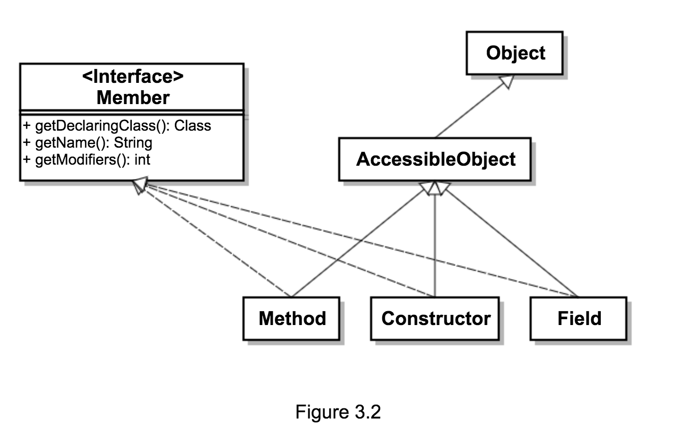

# 3.3.2 使用构造对象

`Class.newInstance` 不是反射构造对象的唯一选择，Java 中的 `java.lang.reflect.Constructor` 元对象类是用来专门表示 **构造函数** 的，`Class` 中用于构造器自省的方法如下表所示：

| 方法 | 描述 |
| :-------------: | :-------------: |
| Constructor getConstructor(Class[] parameterTypes)       | 返回目标类中具有指定参数的 `public` 构造函数       |
| Constructor getDeclaredConstructor(Class[] parameterTypes)       | 返回目标类中具有指定参数的构造函数       |
| Constructor[] getConstructors()       | 返回目标类中具有指定参数的 `public` 构造函数数组       |
| Constructor[] getDeclaredConstructor()       | 返回目标类中具有指定参数的构造函数数组       |

* 表中的方法，可以仅查找 `public` 构造函数，或者查找任意构造函数。

有了上面的方法，则可以通过指定构造函数的 **参数列表** 查找到匹配的构造函数，比如：

```
cls.getConstructor(new Class[]{ String.class, String.class });
```
* 查找目标类中，接受两个 `String` 作为参数的公共构造函数。
* `forName` 返回 `Class` 对象，也可以用在 `getConstructor` 等方法的参数中。

#### `getConstructor` 异常

1. `NoSuchMethodException`
  * 若没有具备 `getConstructor` 方法指定的参数列表的构造函数时抛出。
  * 不会抛出 `NoSuchConstructorException` 异常，在 Java 中没有定义该异常。
2. `SecurityException`
  * 若在安全管理器中禁止使用构造器自省，所有方法都会抛出 `SecurityException`。

### `Constructor` 元类

`Constructor` 是代表 Java 的构造函数的元类，该类具备的接口与 `Method` 类非常相似，唯一的区别在于 `Constructor` 没有 `invoke` 方法，而多了 `newInstance` 方法。`Constructor` 定义的乳房如下表所示：

| 方法签名 | 说明 |
| :-------------: | :-------------: |
| Class getDeclaringClass()       | 返回声明该构造器的类的 `Class` 对象       |
| Class[] getExceptionTypes()       | 返回该构造器 **可以抛出** 的所有异常       |
| int getModifiers()       | 返回该构造器的限定符       |
| String getName()       | 返回该构造器的名字       |
| Class[] getParameterTypes()       | 返回该构造器接受的参数列表（**声明顺序**）       |
| Object newInstance(Object[] initargs)       | 使用 `initargs` 参数调用构造函数，并返回构造出的对象       |

#### `Class.newInstance` 与 `Constructor.newInstance` 区别

`Class` 与 `Constructor` 都有 `newInstance` 方法，却别在于：

* `Class.newInstance()` 不能 **指定参数**，只能调用 **无参构造函数**。
* `Constructor.newInstance(Object[] initargs)` 可以指定调用构造函数的 **参数列表**，可以调用所有类型的构造函数。

#### `Member` 接口 & `AccessibleObject` 父类

`Constructor` 类与 `Method`、`Field` 一样，是 `AccessibleObject` 类的子类，并且也实现了 `Member` 接口，他们之间的关系如下图所示：


